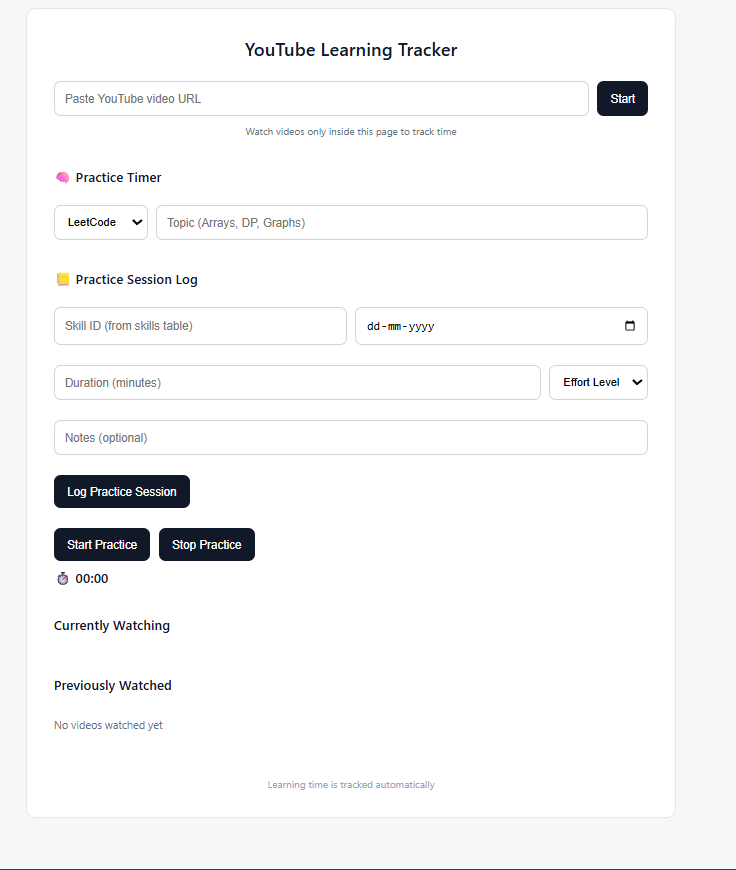

# Streaker – Practice Tracking API

Skill Decay & Learning Consistency Tracker (Streaker)

A backend-driven system built with Spring Boot to help users track their skills, maintain learning streaks, and prevent skill decay by monitoring practice consistency and identifying at-risk skills.

This project focuses on clean architecture, scalability, and extensibility for future AI-driven features.

---
Project Overview

The Streaker system allows users to:

Register and manage multiple skills

Log practice sessions for each skill

Monitor consistency and inactivity

Detect skills that are at risk of decay

Receive insights about their learning behavior

The system is designed to encourage continuous learning and prevent long gaps between practice sessions.

---

##  Features

- Log daily practice sessions for skills
- Validate that practice is logged only for active skills
- Prevent duplicate practice entries for the same skill on the same day
- Clean DTO-based API design
- Automated Entity ↔ DTO mapping using MapStruct
- Added the feature to add uel of youtube to calculate time spent to learn a skill using Youtube

---

##  Tech Stack

- Java 17+
- Spring Boot 3.x
- Spring Data JPA
- MapStruct
- Lombok
- H2 / PostgreSQL
- Maven

---

##  Architecture Overview

The application follows a standard layered architecture:

 Controller → Service → Repository → Database
                ↓
              DTOs
 Key Layers

Controller Layer

Handles REST APIs

Uses ResponseEntity for clean responses

Service Layer

Contains core business logic

Calculates decay & consistency

Repository Layer

JPA Repositories for DB access

DTO Layer

Clean data transfer between client and server

Validation

Ensures reliable & safe input handling

---
## 📁 Project Structure
```Streaker/
│
├── .idea/
│
├── Streaker/
│   ├── .mvn/
│   │
│   ├── src/
│   │   ├── main/
│   │   │   ├── java/
│   │   │   │   └── com.example.Streaker/
│   │   │   │       ├── Config/
│   │   │   │       ├── Controller/
│   │   │   │       ├── DTO/
│   │   │   │       ├── Entity/
│   │   │   │       ├── ExceptionHandler/
│   │   │   │       ├── GraphQL/
│   │   │   │       ├── Mapper/
│   │   │   │       ├── Repo/
│   │   │       │   ├── Service/
│   │   │       │   ├── util/
│   │   │       │   └── StreakerApplication.java
│   │   │
│   │   └── resources/
│   │       ├── graphql/
│   │       │   └── schema.graphqls
│   │       └── application.properties
│   │
│   └── test/
│
├── target/
│
├── .gitattributes
├── .gitignore
├── HELP.md
├── mvnw
└── mvnw.cmd
```
 ---
## Tech Stack
Technology	                  Purpose

Spring Boot	               Backend Framework

Spring Data JPA     	   ORM & DB Access

Hibernate Validator	       Input Validation

PostgreSQL	               Database

Lombok	                   Boilerplate Reduction

Maven	                   Build Tool

GraphQL (Optional)	       Advanced Query Support


---
## Core Features
🔹 Skill Management

Add, update, delete skills

Track each skill independently

🔹 Practice Session Tracking

Log practice dates and durations

Link sessions to skills

🔹 Learning Consistency

Detect irregular practice

Identify inactive periods

🔹 Skill Decay Detection

Flags skills that haven’t been practiced recently

Helps users avoid losing proficiency

🔹 Clean API Responses

Uses ResponseEntity

Meaningful HTTP status codes

---
## How Skill Decay is Handled
Currently, the system:

Checks last practice date per skill

Marks skills as at risk after a configurable inactivity threshold

Helps users focus on neglected skills

This logic is handled in the service layer, making it easy to improve or replace later.

With the new update the streak and productivity is calculated even by time spent to learn using the youtube video.

---
## Future Integration: Spring AI

The project is designed to support AI-powered intelligence using Spring AI in future versions.

Why Spring AI?

Spring AI allows easy integration with:

Local LLMs (Ollama, LM Studio)

Without tightly coupling AI logic into your core system.

---


